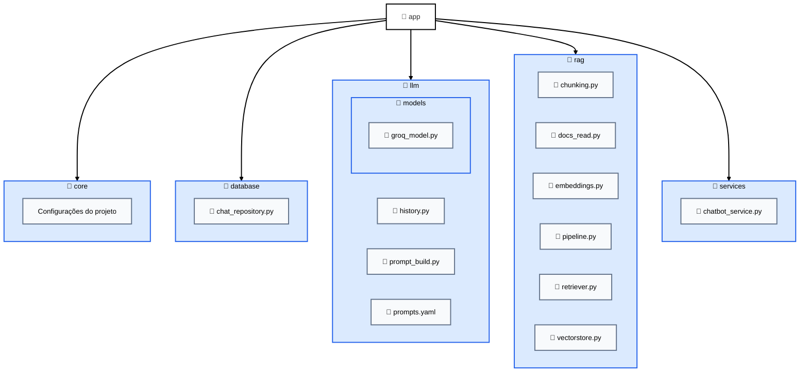
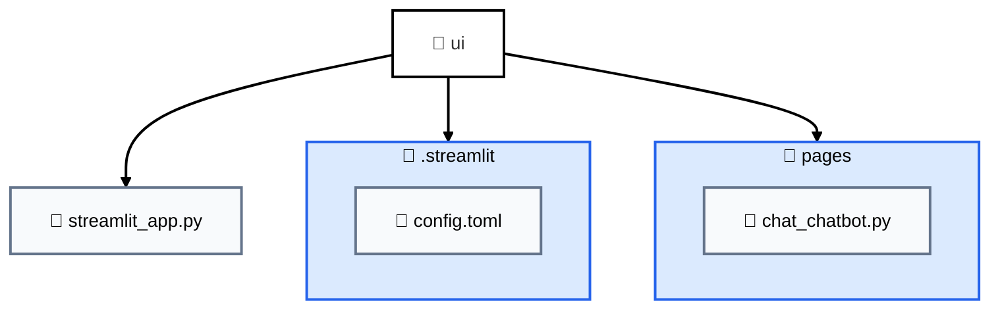

# ChatBot RAG - Regulamento ECT/UFRN

Sistema de chatbot utilizando **RAG (Retrieval-Augmented Generation)** para responder perguntas relacionadas ao regulamento da Escola de Ciências e Tecnologia (ECT) da UFRN.

O projeto utiliza modelos de linguagem (LLMs), banco vetorial e recuperação semântica de documentos para fornecer respostas contextualizadas baseadas no regulamento institucional.

---

# Objetivo do Projeto

Este projeto foi desenvolvido para permitir consultas inteligentes ao regulamento da ECT/UFRN através de linguagem natural.

Com a técnica de **RAG (Retrieval-Augmented Generation)**, o sistema:

1. Recupera trechos relevantes do regulamento;
2. Envia o contexto para um modelo de linguagem;
3. Gera respostas contextualizadas e mais precisas.

Esse tipo de arquitetura reduz alucinações do modelo e melhora a qualidade das respostas em domínios específicos.

---

# Tecnologias Utilizadas

- Python
- LangChain
- ChromaDB
- Ollama
- Groq
- Streamlit
- Embeddings
- Modelos LLM locais

---

# Estrutura do Projeto
## Pasta de aplicação (app)


## Pasta de integração com a interface WEB (ui)


---

# Rodando o projeto

## Dependências 
### Python
```bash

pip install -r requirements.txt

```

### Ollama
#### Instalar o Ollama
```bash

curl -fsSL https://ollama.com/install.sh | sh

```

#### Execultar o Ollama
```bash

ollama serve

```

#### Baixando modelo necessário do Ollama
```bash

ollama pull mxbai-embed-large

```

### Configurando o .env
A estrutura do **.env** ideal está no arquivo **.env.exemple**. Pegue a chave do GROQ no site da API do GROQ: https://console.groq.com/keys

### Execultando o arquivo StreamLit do projeto (main)
Na raiz do projeto rode o seguinte comando:

```bash

streamlit run ui/streamlit_app.py

```
